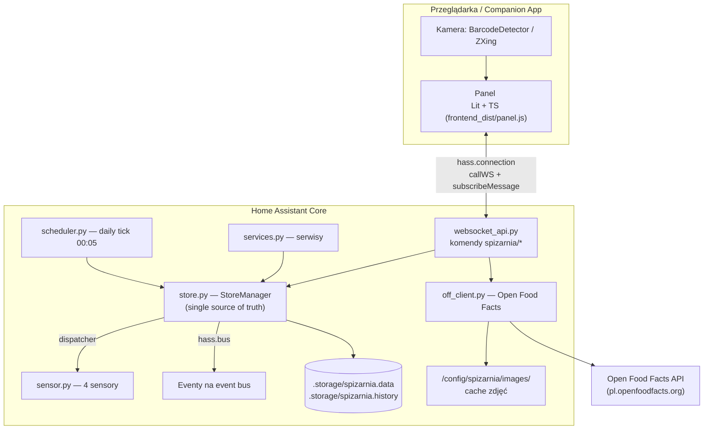

# Spiżarnia — specyfikacja techniczna (dla Claude Code)

Wersja: 1.0 · Data: 2026-07-15 · Status: zatwierdzona do implementacji

---

## 1. Czym jest ten projekt

**Spiżarnia** to custom integration dla Home Assistant do zarządzania domowymi zapasami:
przetworami, konserwami, produktami sypkimi itd. Użytkownik definiuje **pomieszczenia**
(spiżarnia, piwnica, garaż), w nich **półki**, a na półkach trzyma **partie produktów**
z ilością, datą ważności i datą produkcji. Dodawanie wspiera **skanowanie kodów kreskowych
kamerą telefonu** z lookupem w **Open Food Facts**. Całość ma **własny panel w sidebarze HA**
oraz wystawia **sensory i eventy** do automatyzacji (powiadomienia o przeterminowaniu,
kończących się datach, niskich stanach).

### Wymagania twarde (z ustaleń z właścicielem projektu)

1. Działa na **każdej instalacji HA** (OS, Supervised, Container, Core) → **custom integration**, NIE add-on.
2. Instalacja przez **HACS**, zero konfiguracji YAML (config flow).
3. Wpis w **sidebarze** HA — pełnoekranowy panel.
4. Skanowanie kodów **kamerą telefonu** (companion app / przeglądarka).
5. **Sensory + eventy** do automatyzacji HA.
6. Baza produktów: **Open Food Facts** (lookup po kodzie) + **lokalna predefiniowana lista** (edytowalna).
7. UI dwujęzyczne: **polski (domyślny) + angielski**, zgodne z językiem ustawionym w HA.
8. Zgodność z filozofią HA: dane w `.storage` (objęte backupem HA), design tokens HA (motywy działają), brak zewnętrznych zależności runtime poza OFF (opcjonalny).
9. **Open source, darmowe** — licencja MIT, publiczne repo GitHub, docelowo w **domyślnym sklepie HACS**: projekt musi spełniać wymagania [HACS include](https://hacs.xyz/docs/publish/include) oraz mieć ikonę w [home-assistant/brands](https://github.com/home-assistant/brands). Repo, README, kod i commity po angielsku (społeczność międzynarodowa); UI dwujęzyczne pl/en.

---

## 2. Decyzje architektoniczne (ADR w pigułce)

| # | Decyzja | Uzasadnienie | Odrzucone alternatywy |
|---|---------|--------------|----------------------|
| A1 | Custom integration (Python w procesie HA) | Działa wszędzie, backup HA za darmo, auth HA za darmo | Add-on (tylko HA OS), osobny kontener (utrzymanie, auth) |
| A2 | Dane w `homeassistant.helpers.storage.Store` (JSON) | Atomic writes, migracje wersji, backup HA, zero zależności | SQLite (nadmiarowe przy < ~5k rekordów, poza konwencją) |
| A3 | Komunikacja panel↔backend przez **WebSocket API HA** | Auth + push za darmo przez `hass.connection`, standard paneli (tak działa HACS) | REST views (brak push), własny socket (auth) |
| A4 | Frontend: **Lit 3 + TypeScript + Vite**, jeden plik ESM | HA frontend sam jest w Lit; mały bundle; web component wymagany przez `panel_custom` | React (duży bundle, obcy stack), iframe (gorszy UX, brak `hass`) |
| A5 | Skanowanie: `BarcodeDetector` API + fallback `@zxing/browser` | BarcodeDetector natywny na Android/Chrome (companion app = Android WebView); ZXing pokrywa iOS/Firefox | Zewnętrzna appka, natywny plugin (brak) |
| A6 | Lookup OFF **z backendu** (proxy), nie z frontendu | CORS, prywatność (IP usera nie leci do OFF), cache i rate-limit w jednym miejscu | fetch z przeglądarki |
| A7 | Rozdzielenie **ProductDefinition** (katalog) od **Item** (partia na półce) | Przetwory: ten sam produkt, wiele partii z różnymi datami; FEFO wymaga partii | Płaski model produkt=stan |
| A8 | Zbudowany frontend commitowany do `custom_components/spizarnia/frontend_dist/` + release zip | HACS instaluje gotowe pliki; brak kroku build u użytkownika | build on install (niemożliwe) |
| A9 | Własne komponenty UI stylowane tokenami HA; z komponentów HA używamy tylko `ha-icon` | Wewnętrzne `ha-*` są niestabilnym API; tokeny CSS są de facto stabilne | importowanie ha-card, ha-dialog itd. |

---

## 3. Architektura — przegląd



**Zasada jednego źródła prawdy:** wszystkie mutacje przechodzą przez `StoreManager`.
Po każdej mutacji StoreManager: (1) zapisuje storage (debounced 1 s), (2) dopisuje wpis
historii, (3) emituje sygnał dispatchera (aktualizacja sensorów), (4) broadcastuje zmianę
do subskrybentów WS (panel), (5) emituje event na bus HA, jeśli dotyczy.

---

## 4. Struktura repozytorium

Repo: `homeassistant-spizarnia` (GitHub). Katalog roboczy: `C:\projects\spizarnia`.

```
spizarnia/
├── custom_components/spizarnia/
│   ├── __init__.py              # async_setup_entry / async_unload_entry
│   ├── manifest.json
│   ├── const.py                 # DOMAIN, stałe, wersje storage
│   ├── models.py                # dataclasses + (de)serializacja + walidacja
│   ├── store.py                 # StoreManager — CRUD, FEFO, statusy, historia
│   ├── websocket_api.py         # rejestracja komend WS
│   ├── sensor.py                # platforma sensor (4 encje)
│   ├── todo.py                  # platforma todo (lista zakupów) — FAZA 6
│   ├── services.py              # serwisy HA
│   ├── services.yaml
│   ├── panel.py                 # rejestracja panelu + static paths
│   ├── off_client.py            # klient Open Food Facts + cache zdjęć
│   ├── scheduler.py             # daily tick, eventy expiring/expired
│   ├── config_flow.py           # config flow + options flow
│   ├── diagnostics.py           # diagnostyka (bez PII)
│   ├── strings.json             # źródło tłumaczeń config flow / encji
│   ├── translations/
│   │   ├── en.json
│   │   └── pl.json
│   ├── data/
│   │   └── products_pl.json     # predefiniowany katalog (≥150 pozycji)
│   └── frontend_dist/           # ZBUDOWANY panel (commitowany)
│       └── panel.js
├── frontend/                    # źródła panelu
│   ├── package.json
│   ├── tsconfig.json
│   ├── vite.config.ts           # build lib → ../custom_components/spizarnia/frontend_dist/panel.js
│   └── src/
│       ├── panel.ts             # definicja <spizarnia-panel>, przyjmuje hass/narrow/route
│       ├── api.ts               # typowany klient WS + subskrypcja zmian
│       ├── router.ts            # routing wewnętrzny na route prop HA
│       ├── state.ts             # store frontendowy (lekki, własny — patrz §9)
│       ├── i18n/
│       │   ├── pl.json
│       │   └── en.json
│       ├── views/               # spz-view-dashboard, -room, -shelf, -scan,
│       │   └── ...              # -catalog, -product, -history, -settings, -search
│       ├── components/          # spz-* (patrz DESIGN.md §9)
│       └── lib/
│           ├── barcode.ts       # BarcodeDetector + ZXing fallback
│           ├── fefo.ts          # logika podpowiedzi FEFO (mirror backendu)
│           └── dates.ts         # formatowanie dat z precyzją
├── tests/                       # pytest (backend)
│   ├── conftest.py
│   ├── test_store.py
│   ├── test_websocket.py
│   ├── test_sensor.py
│   ├── test_services.py
│   ├── test_off_client.py
│   └── test_scheduler.py
├── dev/
│   ├── docker-compose.yml       # HA dev instance z mountem custom_components
│   └── config/                  # configuration.yaml dev
├── .github/
│   ├── ISSUE_TEMPLATE/          # bug_report.yml, feature_request.yml, config.yml
│   └── workflows/
│       ├── ci.yml               # ruff + pytest + frontend build + hassfest + HACS action
│       └── release.yml          # build frontend → zip → attach do release
├── assets/                      # źródła ikony/logo, eksporty do brands, screenshoty/GIF do README
├── docs/
│   ├── SPEC.md                  # ten plik — specyfikacja techniczna
│   ├── DESIGN.md                # specyfikacja UI/UX
│   └── README.pl.md             # polska wersja README (od fazy 5)
├── .gitattributes               # LF dla py/ts/json/md
├── .gitignore
├── hacs.json
├── LICENSE                      # MIT
├── README.md                    # PO ANGIELSKU (projekt publiczny)
└── CLAUDE.md                    # instrukcje dla Claude Code (musi być w root)
```

### manifest.json

```json
{
  "domain": "spizarnia",
  "name": "Spiżarnia",
  "codeowners": ["@<github-user>"],
  "config_flow": true,
  "dependencies": ["http", "websocket_api", "frontend"],
  "documentation": "https://github.com/<github-user>/homeassistant-spizarnia",
  "integration_type": "service",
  "iot_class": "calculated",
  "issue_tracker": "https://github.com/<github-user>/homeassistant-spizarnia/issues",
  "requirements": [],
  "single_config_entry": true,
  "version": "0.1.0"
}
```

Minimalna wersja HA: **2025.6.0** (w `hacs.json` → `homeassistant`). Zero pozycji w
`requirements` — OFF przez `aiohttp` z sesji HA, storage wbudowany.

### hacs.json

```json
{
  "name": "Spiżarnia",
  "homeassistant": "2025.6.0",
  "zip_release": true,
  "filename": "spizarnia.zip"
}
```

---

## 5. Model danych

Wszystkie ID: `uuid4().hex`. Wszystkie timestampy: ISO 8601 UTC. Daty (bez czasu): `YYYY-MM-DD`.

### 5.1 Room — pomieszczenie

```python
@dataclass
class Room:
    id: str
    name: str                    # "Spiżarnia", "Piwnica"
    icon: str = "mdi:cupboard"   # ikona MDI
    order: int = 0               # kolejność wyświetlania
    created_at: str = ...        # ISO UTC
```

### 5.2 Shelf — półka

```python
@dataclass
class Shelf:
    id: str
    room_id: str
    name: str                    # "Górna", "Regał A / poziom 2"
    order: int = 0
    notes: str = ""
```

### 5.3 ProductDefinition — pozycja katalogu

```python
@dataclass
class ProductDefinition:
    id: str
    name: str                     # "Ogórki kiszone"
    category: str                 # klucz kategorii, patrz §5.6
    emoji: str = ""               # "🥒" — podstawowa reprezentacja wizualna
    image: str | None = None      # ścieżka względna w /spizarnia_files/images/
    default_unit: str = "szt"     # patrz §5.7
    barcodes: list[str] = []      # EAN-y przypisane do produktu (unikalne globalnie)
    default_shelf_life_days: int | None = None  # autopodpowiedź daty ważności
    min_stock: float | None = None              # próg niskiego stanu (suma partii)
    notes: str = ""
    source: str = "user"          # "predefined" | "off" | "user"
    created_at: str = ...
```

### 5.4 Item — partia produktu na półce

```python
@dataclass
class Item:
    id: str
    product_id: str
    shelf_id: str
    quantity: float               # > 0; przy zejściu do 0 → partia usuwana (z wpisem historii)
    unit: str
    best_before: str | None = None            # "2027-06-30"
    best_before_precision: str = "day"        # "day" | "month" | "year" | "none"
    production_date: str | None = None
    opened: bool = False          # otwarty słoik/opakowanie → priorytet FEFO
    notes: str = ""
    added_at: str = ...
    added_by: str | None = None   # user_id HA
    notified_expiring: bool = False   # event expiring_soon wysłany
    notified_expired: bool = False    # event expired wysłany
```

**Precyzja daty ważności** — przetwory często mają tylko rok albo miesiąc:
- `day` → przechowuj pełną datę; przeterminowane od dnia następnego
- `month` → przechowuj ostatni dzień miesiąca; wyświetlaj "06.2027"
- `year` → przechowuj 31.12; wyświetlaj "2027"
- `none` → produkt bezterminowy (sól, cukier, alkohol); nigdy nie alarmuj

### 5.5 HistoryEntry

```python
@dataclass
class HistoryEntry:
    id: str
    ts: str                       # ISO UTC
    type: str                     # "add" | "consume" | "move" | "adjust" | "open" |
                                  # "delete" | "expire_notice"
    product_id: str
    product_name: str             # snapshot — produkt może zostać usunięty
    item_id: str | None
    quantity_delta: float | None  # +5 przy add, -1 przy consume
    unit: str | None
    shelf_id: str | None
    shelf_path: str | None        # snapshot "Piwnica / Regał A"
    user_id: str | None
    user_name: str | None         # snapshot
    details: dict = {}            # np. {"from_shelf": ..., "to_shelf": ...}
```

Retencja: max **2000 wpisów** lub **400 dni** — starsze przycinane przy daily tick.

### 5.6 Kategorie (stałe, klucze EN, etykiety tłumaczone)

| klucz | PL | emoji domyślne |
|---|---|---|
| `preserves_sweet` | Przetwory słodkie (dżemy, konfitury, powidła) | 🍓 |
| `preserves_savory` | Przetwory wytrawne (kiszonki, marynaty, sosy) | 🥒 |
| `compotes_juices` | Kompoty i soki | 🍑 |
| `honey_syrups` | Miody, syropy, nalewki | 🍯 |
| `canned` | Konserwy i puszki | 🥫 |
| `dry_goods` | Sypkie (mąka, cukier, kasze, ryż, makaron) | 🌾 |
| `spices` | Przyprawy i dodatki | 🧂 |
| `oils_fats` | Oleje i tłuszcze | 🫒 |
| `drinks` | Napoje | 🧃 |
| `sweets_snacks` | Słodycze i przekąski | 🍫 |
| `frozen` | Mrożonki | ❄️ |
| `household` | Chemia i gospodarcze | 🧻 |
| `other` | Inne | 📦 |

### 5.7 Jednostki (stałe)

`szt`, `słoik` (jar), `butelka` (bottle), `puszka` (can), `opak` (pack), `kg`, `g`, `l`, `ml`.
Quantity to float (0.5 kg mąki jest legalne). Bez przeliczania między jednostkami w MVP.

### 5.8 Settings (w options config entry, nie w storage)

```python
expiring_soon_days: int = 30     # próg "kończy się termin" (przetwory → 30 zamiast 14)
off_enabled: bool = True         # lookup Open Food Facts
off_locale: str = "pl"           # pl.openfoodfacts.org, fallback world
default_room_id: str | None     # domyślne pomieszczenie przy dodawaniu
history_retention_days: int = 400
```

### 5.9 Predefiniowany katalog — `data/products_pl.json`

Minimum **150 pozycji** typowych dla polskiej spiżarni, pokrywających wszystkie kategorie
(dżem truskawkowy, powidła śliwkowe, ogórki kiszone, kapusta kiszona, grzybki marynowane,
przecier pomidorowy, kompot wiśniowy, sok malinowy, miód lipowy, mąka pszenna 500,
cukier biały, kasza gryczana, ryż, makaron, konserwy rybne/mięsne, groszek, kukurydza,
olej rzepakowy, herbaty, ...). Format pozycji:

```json
{
  "name_pl": "Ogórki kiszone",
  "name_en": "Pickled cucumbers (fermented)",
  "category": "preserves_savory",
  "emoji": "🥒",
  "default_unit": "słoik",
  "default_shelf_life_days": 365
}
```

Katalog importowany do storage przy **pierwszym** setupie (source=`predefined`);
użytkownik może pozycje edytować i usuwać — reimport nigdy nie nadpisuje zmian
(import tylko gdy storage pusty).

---

## 6. Warstwa storage — `store.py`

- `Store(hass, STORAGE_VERSION=1, "spizarnia.data")` → `{rooms, shelves, products, items}`
- `Store(hass, STORAGE_VERSION=1, "spizarnia.history")` → `{entries: [...]}` (osobno — inna częstotliwość zapisu, duży rozmiar)
- Zapis przez `Store.async_delay_save(self._data_to_save, 1.0)` — debounce 1 s.
- `async_migrate_func` od dnia 1 (nawet no-op) — wersjonowanie schematu obowiązkowe.
- **StoreManager** trzyma dane w pamięci (dicty po id), wystawia metody domenowe:

```
rooms:    list / create / update / delete(cascade: shelves+items) / reorder
shelves:  list / create / update / delete(cascade: items) / reorder
products: list / search(query, category) / create / update / delete(blokada gdy istnieją items) /
          find_by_barcode(code)
items:    list(filters) / add / update / consume(item_id, qty) /
          consume_fefo(product_id, qty) → [(item, qty_taken), ...] /
          move(item_id, shelf_id) / set_opened / delete
history:  list(filters, paging) / add_entry / prune
stats:    counts per room/shelf/status — wyliczane na żądanie z pamięci
```

**FEFO (first-expired-first-out)** — `consume_fefo` sortuje partie produktu:
`opened DESC, best_before ASC NULLS LAST, added_at ASC` i zdejmuje kolejno aż pokryje qty.
Zwraca listę faktycznych operacji (do odpowiedzi serwisu/WS i historii).

**Statusy świeżości** (wyliczane, nie przechowywane):
- `expired` — `best_before < dziś` (wg precyzji)
- `expiring_soon` — `dziś ≤ best_before ≤ dziś + expiring_soon_days`
- `ok` — dalej niż próg
- `no_date` — `precision == none` lub brak daty

Kaskady usuwania **wymagają** potwierdzenia po stronie UI (WS zwraca w odpowiedzi
`affected_items: n` przy `dry_run=true` — pierwszy call z dry_run, drugi właściwy).

---

## 7. WebSocket API — `websocket_api.py`

Wszystkie komendy z prefixem `spizarnia/`. Rejestracja przez
`websocket_api.async_register_command`. Wszystkie wymagają zalogowanego usera
(standard WS HA); **nie** wymagają admina. Walidacja voluptuous na każdej komendzie.
Błędy: `websocket_api.error_message(id, code, message)` z kodami:
`not_found`, `invalid_input`, `conflict` (np. duplikat barcode), `off_unavailable`.

### 7.1 Subskrypcja zmian (push do panelu)

```
type: "spizarnia/subscribe"
→ subskrypcja; serwer wysyła eventy:
   {"event": {"collection": "items" | "products" | "shelves" | "rooms" |
              "history" | "settings", "action": "changed"}}
```

Panel po evencie refetchuje daną kolekcję (prosty model; delty — nie w MVP).

### 7.2 Odczyt

| komenda | payload | odpowiedź |
|---|---|---|
| `spizarnia/overview` | — | `{rooms:[{...room, shelf_count, item_count, expired, expiring}], stats:{expired, expiring_soon, low_stock, total_items, total_quantity}, recent_history:[5]}` |
| `spizarnia/rooms/list` | — | `{rooms: Room[]}` |
| `spizarnia/shelves/list` | `{room_id?}` | `{shelves: [{...Shelf, item_count, expired, expiring, preview:[{emoji,image} x8]}]}` |
| `spizarnia/products/list` | `{query?, category?, limit?, offset?}` | `{products: [{...ProductDefinition, total_quantity, item_count}]}` |
| `spizarnia/items/list` | `{shelf_id? \| room_id? \| product_id? \| status?}` | `{items: [{...Item, product: ProductDefinition, status, days_left}]}` |
| `spizarnia/history/list` | `{limit=50, offset, type?, product_id?, room_id?}` | `{entries: HistoryEntry[], total}` |
| `spizarnia/settings/get` | — | `{settings}` |
| `spizarnia/search` | `{query}` | zunifikowane wyniki: produkty + partie z lokalizacją |

### 7.3 Mutacje

| komenda | payload (istotne pola) |
|---|---|
| `spizarnia/rooms/create` | `{name, icon?}` |
| `spizarnia/rooms/update` | `{room_id, name?, icon?}` |
| `spizarnia/rooms/delete` | `{room_id, dry_run?}` → `{affected_shelves, affected_items}` przy dry_run |
| `spizarnia/rooms/reorder` | `{room_ids: [...]}` |
| `spizarnia/shelves/create\|update\|delete\|reorder` | analogicznie (`room_id` przy create) |
| `spizarnia/products/create` | `{name, category, emoji?, default_unit?, barcodes?, default_shelf_life_days?, min_stock?, notes?}` |
| `spizarnia/products/update` | `{product_id, ...pola}` — walidacja unikalności barcode |
| `spizarnia/products/delete` | `{product_id}` → błąd `conflict` gdy istnieją partie |
| `spizarnia/items/add` | `{product_id, shelf_id, quantity, unit?, best_before?, best_before_precision?, production_date?, notes?}` → `{item}` |
| `spizarnia/items/update` | `{item_id, ...pola}` (korekta ilości → historia `adjust`) |
| `spizarnia/items/consume` | `{item_id, quantity}` → `{item?}` (null gdy zeszła do 0) |
| `spizarnia/items/consume_fefo` | `{product_id, quantity}` → `{operations:[{item_id, taken, remaining}]}` |
| `spizarnia/items/move` | `{item_id, shelf_id}` |
| `spizarnia/items/set_opened` | `{item_id, opened}` |
| `spizarnia/items/delete` | `{item_id, reason?}` |
| `spizarnia/settings/update` | `{...settings}` |
| `spizarnia/export` | `{format: "json"}` → pełny dump (import — roadmap) |

### 7.4 Kody kreskowe

```
type: "spizarnia/barcode/lookup", payload: {code: "5900334000123"}
→ {match: "local",  product: ProductDefinition}                    # kod znany w katalogu
→ {match: "off",    suggestion: {name, brand, quantity_text,
                                 image_url?, categories: [...],
                                 suggested_category, code}}         # znaleziony w OFF
→ {match: "none",   code}                                           # nieznany
```

Przy `products/create`/`update` z `image_url` z OFF: backend pobiera obraz, zapisuje do
`/config/spizarnia/images/<product_id>.jpg` (max 512 px, JPEG), ustawia `image`.

---

## 8. Encje, eventy, serwisy

### 8.1 Urządzenie i sensory — `sensor.py`

Jedno urządzenie **„Spiżarnia"** (`identifiers={(DOMAIN, entry.entry_id)}`). Encje z
`has_entity_name=True`, nazwy przez `translation_key` (strings.json + translations/pl.json).
Aktualizacja przez `async_dispatcher_connect(hass, SIGNAL_DATA_CHANGED, ...)` — push,
`should_poll=False`.

| encja (sugerowane entity_id) | stan | atrybuty |
|---|---|---|
| `sensor.spizarnia_przeterminowane` | liczba partii przeterminowanych | `items: [{product, quantity, unit, best_before, location}]` (max 30) |
| `sensor.spizarnia_konczacy_sie_termin` | liczba partii ≤ progu | jw. + `days_left`; `threshold_days` |
| `sensor.spizarnia_niskie_stany` | liczba produktów pod `min_stock` | `products: [{name, total, min_stock, unit}]` |
| `sensor.spizarnia_produkty` | łączna liczba partii | `total_quantity`, `by_room: {...}`, `by_category: {...}` |

### 8.2 Eventy na bus HA

| event | kiedy | data |
|---|---|---|
| `spizarnia_item_added` | dodanie partii | `{item_id, product_id, product_name, quantity, unit, room, shelf, user_id}` |
| `spizarnia_item_consumed` | wydanie (także FEFO) | `{product_id, product_name, quantity, unit, remaining_total, user_id}` |
| `spizarnia_item_expiring_soon` | daily tick: partia przekroczyła próg (raz, flaga `notified_expiring`) | `{item_id, product_name, best_before, days_left, room, shelf, quantity, unit}` |
| `spizarnia_item_expired` | daily tick: partia przeterminowana (raz) | jw. |
| `spizarnia_low_stock` | stan produktu spadł pod `min_stock` (przy consume) | `{product_id, product_name, total, min_stock, unit}` |

Przykładowa automatyzacja (do README):

```yaml
trigger:
  - platform: event
    event_type: spizarnia_item_expiring_soon
action:
  - service: notify.mobile_app_telefon
    data:
      title: "Spiżarnia 🫙"
      message: >
        {{ trigger.event.data.product_name }} — kończy się termin
        ({{ trigger.event.data.best_before }}), {{ trigger.event.data.room }}.
```

### 8.3 Serwisy — `services.py` + `services.yaml`

| serwis | pola | response |
|---|---|---|
| `spizarnia.add_item` | `product` (nazwa/id/barcode), `quantity`, `unit?`, `best_before?`, `shelf_id?` (default: ostatnio używana) | `{item_id}` |
| `spizarnia.consume` | `product` (nazwa/id/barcode), `quantity` | `SupportsResponse.OPTIONAL`: `{operations: [...]}` (FEFO) |
| `spizarnia.move_item` | `item_id`, `shelf_id` | — |

Dopasowanie po nazwie: case-insensitive exact → jednoznaczny prefix → błąd z listą kandydatów.

### 8.4 Platforma `todo` — FAZA 6 (opcjonalna, po MVP)

`todo.spizarnia_zakupy` — pozycje generowane automatycznie z produktów pod `min_stock`
(odhaczenie = niczego nie zmienia w stanach; pozycja znika, gdy stan uzupełniony).
Ręczne pozycje dozwolone. To daje listę zakupów w standardowym UI HA i companion app.

---

## 9. Panel frontend

### 9.1 Rejestracja — `panel.py`

```python
await hass.http.async_register_static_paths([
    StaticPathConfig("/spizarnia_files", DIST_PATH, cache_headers=True),
    StaticPathConfig("/spizarnia_files/images", IMAGES_PATH, cache_headers=True),
])
frontend.async_register_built_in_panel(
    hass,
    component_name="custom",
    sidebar_title="Spiżarnia",         # przez translations jeśli możliwe
    sidebar_icon="mdi:cupboard",
    frontend_url_path="spizarnia",
    config={"_panel_custom": {
        "name": "spizarnia-panel",
        "module_url": f"/spizarnia_files/panel.js?v={VERSION}",  # cache-bust wersją
        "embed_iframe": False,
        "trust_external": False,
    }},
    require_admin=False,               # wszyscy domownicy
)
```

Przy `async_unload_entry`: `frontend.async_remove_panel(hass, "spizarnia")`.

### 9.2 Kontrakt panelu

`<spizarnia-panel>` otrzymuje od HA properties: `hass` (z `connection`, `callWS`,
`user`, `language`, `themes`), `narrow` (bool — wąski layout), `route`, `panel`.
Klient API (`api.ts`):

```ts
hass.callWS({type: "spizarnia/items/add", ...})
hass.connection.subscribeMessage(onEvent, {type: "spizarnia/subscribe"})
```

### 9.3 Stan i routing

- `state.ts`: lekki store (własny, pub/sub na kolekcjach; bez Redux/MobX). Kolekcje
  cache'owane, inwalidowane eventem subskrypcji.
- `router.ts`: ścieżki wewnątrz `/spizarnia/...`:
  `""` dashboard · `room/<id>` · `shelf/<id>` · `scan` · `add` · `catalog` ·
  `catalog/<id>` · `history` · `search` · `settings`.
  Nawigacja: `history.pushState` + `window.dispatchEvent(new Event("location-changed"))`
  (konwencja HA, sidebar podświetla się poprawnie).

### 9.4 Build

- Vite lib mode, target `es2021`, format ESM, **jeden plik** `panel.js` (ZXing jako
  dynamic import → drugi chunk `zxing-<hash>.js` ładowany tylko przy skanowaniu na
  urządzeniach bez BarcodeDetector; Vite: `output.manualChunks`).
- `npm run build` → pisze prosto do `custom_components/spizarnia/frontend_dist/`.
- `npm run watch` → tryb dev (rebuild na zmianę; odświeżenie strony ręczne).
- Zależności runtime frontendu: `lit`, `@zxing/browser` (lazy). Nic więcej.

### 9.5 Motywy i style

Wyłącznie tokeny HA (pełna lista w DESIGN.md §3): `--primary-color`,
`--card-background-color`, `--primary-text-color`, `--divider-color`,
`--error-color`, `--warning-color`, `--success-color`, `--ha-card-border-radius`, itd.
Panel dziedziczy motyw automatycznie (dark/light/custom). Zakaz hardkodowania kolorów
poza zdefiniowanymi w DESIGN.md kolorami kategorii (które mają warianty dark/light).

---

## 10. Skanowanie kodów — `lib/barcode.ts`

1. Wymaganie: **HTTPS** (getUserMedia). W README wprost: skanowanie działa przez
   Nabu Casa / własny reverse proxy z TLS; po HTTP tylko ręczne wpisanie kodu.
2. Detekcja: `"BarcodeDetector" in window` i wspiera formaty → użyj natywnego;
   inaczej dynamic import ZXing.
3. Formaty: `ean_13`, `ean_8`, `upc_a`, `code_128`, `qr_code` (QR — na przyszłe
   własne etykiety słoików, roadmap).
4. Kamera: `getUserMedia({video: {facingMode: "environment"}})`, przełącznik latarki
   (`ImageCapture`/`applyConstraints({advanced:[{torch:true}]})` — try/catch, nie wszędzie działa).
5. Pętla detekcji: ~10 fps na klatce wideo; po trafieniu — wibracja
   (`navigator.vibrate(50)`), stop kamery, callback z kodem.
6. Deduplikacja: ten sam kod ignorowany przez 3 s (tryb seryjny skanuje wiele sztuk).
7. Fallback zawsze widoczny: pole ręcznego wpisania kodu + klawiatura numeryczna
   (`inputmode="numeric"`). To pokrywa też skanery USB/BT (działają jak klawiatura).

---

## 11. Open Food Facts — `off_client.py`

- Endpoint: `https://{locale}.openfoodfacts.org/api/v2/product/{code}?fields=product_name,product_name_pl,brands,quantity,image_front_url,categories_tags` (locale z settings, fallback `world` przy 404).
- Session: `aiohttp_client.async_get_clientsession(hass)`, timeout 10 s.
- **User-Agent obowiązkowy**: `Spizarnia-HA/{version} (+https://github.com/<user>/homeassistant-spizarnia)`.
- Cache odpowiedzi w pamięci (TTL 24 h) — ponowny skan tego samego kodu nie strzela do API.
- Mapowanie `categories_tags` → nasza kategoria: prosty słownik prefiksów
  (`en:jams→preserves_sweet`, `en:canned-*→canned`, ...), default `other`.
- Obrazek: pobierz, przeskaluj do max 512 px (Pillow jest w HA core), zapisz JPEG q=80
  do `/config/spizarnia/images/`. Ścieżka względna w `ProductDefinition.image`.
- Awaria OFF (timeout / 5xx / brak sieci) → `{match: "none"}` + flaga `off_error: true`
  (UI pokaże „nie udało się sprawdzić — dodaj ręcznie"). Nigdy nie blokuje flow.

---

## 12. Scheduler — `scheduler.py`

- `async_track_time_change(hass, tick, hour=0, minute=5, second=0)` + tick przy starcie integracji.
- Tick: przelicz statusy wszystkich partii → dla nowych `expired`/`expiring_soon`
  emituj eventy (raz — flagi `notified_*`), zaktualizuj sensory, przytnij historię.
- Zmiana `expiring_soon_days` w options → reset flag `notified_expiring` dla partii,
  które przy nowym progu już się nie łapią; przeliczenie natychmiastowe.

---

## 13. Config flow — `config_flow.py`

- **Config flow**: jeden krok, zero pól (potwierdzenie instalacji). `single_config_entry`.
- Po pierwszym setup: seed katalogu z `products_pl.json` + utworzenie przykładowego
  pomieszczenia „Spiżarnia" z półką „Półka 1" (onboarding UI może to zmienić).
- **Options flow**: `expiring_soon_days` (NumberSelector 1–365), `off_enabled` (bool),
  `off_locale` (select: pl/world/de/…), `history_retention_days`.
- Zmiana options → `entry.async_on_unload(entry.add_update_listener(...))` → przeładowanie ustawień bez restartu.

---

## 14. i18n

- **Backend** (config flow, nazwy encji, serwisy): `strings.json` + `translations/pl.json`, `translations/en.json`.
- **Frontend**: własne `i18n/pl.json`, `i18n/en.json`; wybór wg `hass.language`
  (pl → pl, wszystko inne → en). Helper `t(key, vars)`; klucze płaskie z kropkami
  (`dashboard.expired_count`). Polskie formy mnogie: funkcja plural PL
  (1 partia / 2 partie / 5 partii) — dedykowany helper `plural(n, [jeden, kilka, wiele])`.
- Daty w UI: `Intl.DateTimeFormat(hass.locale)`; z uwzględnieniem precyzji (§5.4).

---

## 15. Bezpieczeństwo i prywatność

- Panel `require_admin=False`; wszystkie komendy WS dostępne dla każdego zalogowanego
  użytkownika (spiżarnia = cały dom). Historia zapisuje `user_id`/`user_name`.
- Żadne dane nie opuszczają instalacji poza zapytaniem do OFF (sam kod kreskowy;
  opcja `off_enabled=false` wyłącza całkowicie).
- Ścieżki obrazków walidowane (brak path traversal — tylko `<uuid>.jpg` w katalogu images).
- Limit rozmiaru uploadu własnych zdjęć (roadmap): 5 MB.
- `diagnostics.py`: liczby rekordów i ustawienia, bez nazw produktów.

---

## 16. Testowanie

- **Backend**: `pytest` + `pytest-homeassistant-custom-component`. Obowiązkowe obszary:
  - StoreManager: CRUD wszystkich kolekcji, kaskady, FEFO (partie z opened/bez dat/różne daty), statusy przy precyzjach dat, migracje storage, prune historii
  - WS API: happy path + walidacja + not_found/conflict dla każdej komendy
  - Sensory: wartości po mutacjach; eventy: emisja + jednokrotność (flagi)
  - OFF client: mock aiohttp (znaleziony / 404 / timeout / mapowanie kategorii)
  - Scheduler: przejścia statusów na granicach dat i precyzji
  - Serwisy: dopasowanie po nazwie/barcode, response data
- **Frontend**: `vitest` na czystej logice (`dates.ts`, `fefo.ts`, `i18n` plural).
  Testy komponentów — nie w MVP.
- Cel pokrycia backendu: ≥ 85 % na `store.py`.

---

## 17. CI / Release / publikacja HACS

### 17.1 CI i release

- `ci.yml` (push/PR): ruff check + format-check, pytest, `npm ci && npm run build`
  (fail, gdy dist różni się od commitowanego — pilnuje świeżości dist),
  `home-assistant/actions/hassfest`, `hacs/action`.
- `release.yml` (tag `v*`): build frontendu → zip zawartości
  `custom_components/spizarnia` jako `spizarnia.zip` → attach do GitHub Release
  + auto-generowane release notes (kategorie po labelach PR).
  Wersja w manifest.json podbijana ręcznie przed tagiem (semver: 0.x do MVP).

### 17.2 Wymagania publicznego repo (HACS default store)

Checklist — wszystko musi być spełnione PRZED zgłoszeniem do domyślnego sklepu:

- [ ] Repo publiczne, nie-fork, z **description po angielsku** i **topics**:
      `home-assistant`, `hacs`, `home-assistant-integration`, `pantry`,
      `food-inventory`, `expiration-tracker`
- [ ] `LICENSE` — MIT
- [ ] `README.md` po angielsku: badge'y (release / HACS / licencja), GIF demo,
      instalacja (HACS), konfiguracja, sensory/eventy/serwisy z przykładowymi
      automatyzacjami, FAQ (w tym: **skaner wymaga HTTPS**), sekcja po polsku
      lub link do tłumaczenia
- [ ] `hacs.json` poprawny; manifest z `domain`, `name`, `version`,
      `documentation`, `issue_tracker`, `codeowners`
- [ ] Issue templates (bug/feature) + krótki `CONTRIBUTING.md`
- [ ] Min. jeden **GitHub Release** z załączonym `spizarnia.zip`
- [ ] `hassfest` i `hacs/action` zielone na main
- [ ] **Ikona w brands** (patrz 17.3) — bez tego HACS nie przyjmie do default

### 17.3 Proces publikacji (kroki zewnętrzne, po release 1.0)

1. **Brands**: PR do `home-assistant/brands` z plikami
   `custom_integrations/spizarnia/icon.png` (256×256) i `icon@2x.png` (512×512),
   przezroczyste tło, przycięte do treści (projekt ikony: DESIGN.md, deliverable #9).
   Po merge ikona pokazuje się w UI HA (integracje, config flow) i w HACS.
2. **HACS default**: PR do repo `hacs/default` — dodanie `owner/homeassistant-spizarnia`
   do listy `integration` (alfabetycznie). Bot waliduje repo automatycznie.
3. Czas oczekiwania na review bywa długi (tygodnie–miesiące) — **README od dnia 1
   zawiera instrukcję instalacji jako custom repository** (funkcjonalnie identyczna,
   różni się tylko brakiem wpisu w wyszukiwarce HACS).
4. Po akceptacji: aktualizacja README (usunięcie kroku custom repository).

---

## 18. Środowisko deweloperskie

- `dev/docker-compose.yml`: obraz `ghcr.io/home-assistant/home-assistant:stable`,
  port 8123, mount: `../custom_components → /config/custom_components`,
  `./config → /config` (trwały config dev z utworzonym userem).
- Flow pracy: `npm run watch` w `frontend/` + odświeżenie przeglądarki;
  zmiany Pythona → restart kontenera (`docker compose restart`).
- Windows: uwaga na CRLF — `.gitattributes` z `* text=auto eol=lf` dla `.py/.ts/.json`.

---

## 19. Fazy implementacji (kolejność dla Claude Code)

Każda faza kończy się działającym stanem i zielonym CI. Nie zaczynaj kolejnej fazy
przed spełnieniem Definition of Done poprzedniej.

### Faza 0 — szkielet (DoD: integracja instaluje się, panel "Hello" w sidebarze)
manifest, const, config_flow (pusty krok), `__init__.py`, panel.py + static paths,
frontend: vite + panel.ts renderujący "Spiżarnia" z tokenami HA, hacs.json, CI, dev compose, testy setup/unload.

### Faza 1 — dane i API (DoD: pełny CRUD przez WS, testy store ≥85 %)
models, store.py (wszystkie metody + FEFO + statusy), websocket_api (wszystkie komendy §7 poza barcode), subskrypcja zmian, seed katalogu products_pl.json (≥150 pozycji), historia.

### Faza 2 — panel: przeglądanie i CRUD (DoD: pełna nawigacja bez skanera)
api.ts + state.ts + router, widoki: dashboard, room, shelf, catalog, search, settings, history; komponenty bazowe (DESIGN.md §9); flow dodawania partii Z KATALOGU (bez skanera); flow wydawania z FEFO; empty states + onboarding; i18n pl/en; narrow/desktop layouty.

### Faza 3 — encje i automatyzacje (DoD: sensory żyją, eventy strzelają, serwisy działają)
sensor.py + device, dispatcher, eventy §8.2, scheduler (daily tick + flagi), services.py + services.yaml + strings, diagnostics, przykłady automatyzacji w README.

### Faza 4 — skaner i OFF (DoD: skan → produkt → partia w ≤ 20 s)
lib/barcode.ts (BarcodeDetector + lazy ZXing + ręczny input), widok scan, off_client.py + `barcode/lookup` + cache zdjęć, flow: skan → local/off/none → formularz partii, tryb seryjny, przypisywanie kodów do produktów w katalogu.

### Faza 5 — polish i release 1.0 (DoD: publiczne repo spełnia checklist §17.2, release zip na GitHub)
puste stany/ładowanie/błędy wszędzie, toast+undo, reorder pomieszczeń/półek, eksport JSON, wydajność (≤ 200 ms render półki ze 100 partiami), audyt i18n, LICENSE + README EN (badge'y, GIF, automatyzacje, FAQ) + issue templates + CONTRIBUTING, assets ikony (eksporty pod brands), release.yml, tag v1.0.0.

### Publikacja do HACS default (proces zewnętrzny, równolegle po fazie 5)
PR do `home-assistant/brands` → po merge PR do `hacs/default` (szczegóły §17.3).
Do czasu akceptacji użytkownicy instalują przez custom repository.

### Faza 6+ — roadmap (osobne decyzje, nie planować teraz)
platforma todo (lista zakupów) · encja calendar z datami ważności · karta Lovelace (mini-podgląd) · własne etykiety QR na słoiki (generowanie + druk + skan `SPZ:item:<id>`) · import JSON/CSV · zdjęcia własne z aparatu · statystyki zużycia/wykresy · multi-language katalogu.

---

## 20. Ryzyka i uwagi dla implementującego

1. **`panel_custom` + `module_url`** — cache przeglądarki: zawsze wersjonuj query paramem.
2. **BarcodeDetector na iOS** — brak wsparcia (stan na 2026): ZXing fallback jest
   obowiązkowy, nie opcjonalny. Testuj na iPhonie przez Nabu Casa.
3. **Store debounce** — przy szybkim wydawaniu wielu partii zapis się skleja; to OK,
   ale `async_stop` (`homeassistant.helpers.storage` robi flush przy zamykaniu) musi być przetestowany.
4. **Wielkość atrybutów sensorów** — HA recorder loguje atrybuty; tnij listy do 30
   pozycji i wyłącz zbędne (`_unrecorded_attributes` dla list szczegółowych).
5. **Nazwa domeny `spizarnia`** — bez polskich znaków, spójna wszędzie (domain, event
   prefix, WS prefix, storage keys, url path).
6. **Nie importuj wewnętrznych komponentów HA frontendu** (`ha-card`, `ha-dialog`...)
   — wyjątek: `ha-icon` (stabilne). Własne komponenty wg DESIGN.md.
7. **Konflikt barcode** — jeden kod = jeden produkt; przy próbie duplikatu WS zwraca
   `conflict` z nazwą produktu, który już go ma; UI oferuje przejście do niego.
